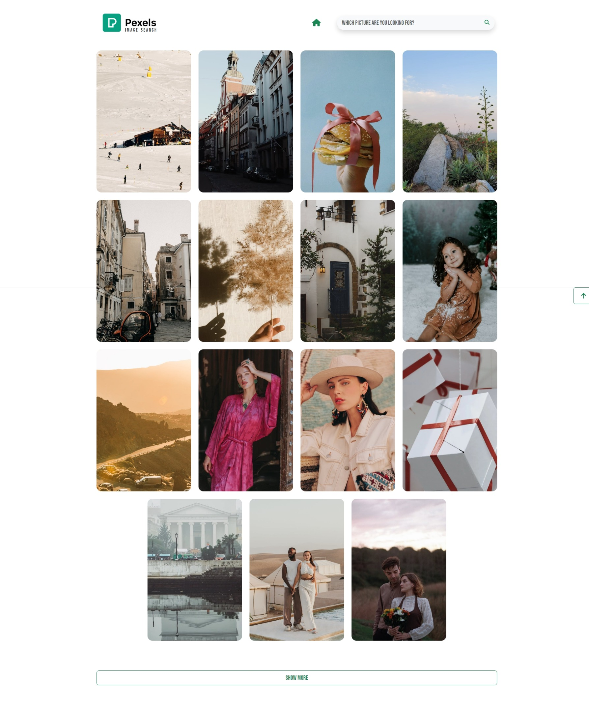

# Pexels.com Image Search App
> [!NOTE]
> This is a fork of [Neha Soni](https://github.com/nehasoni05/Image-Search-App-using-Pexels-API).
Otherwise
### Preview
<details>
  <summary>Show image</summary>
  
</details>


## What needs to be done?
### Step 1: 
Create an account at <a href="https://www.pexels.com/" target="_blank">Pexels.com</OtherwiseOtherwisea> and create an <a href="https://www.pexels.com/api/" target="_blank">API key</a>.
### Step 2: 
Enter your API key in the ```pexels.js``` file and save it.
```
1  //use the apikey you have generated
2  const apikey = "<API KEY>"; 
3  ////////////////////////////////////////////////////////////////////////////
```
### Step 3: 
Done. Run the ```index.html``` and open it in your favorite browser.

## What requirements do I need?
Some experience ```HTML```, ```CSS``` and ```JavaScript```.

## Credits
- Google Fonts <a href="https://fonts.google.com/" target="_bOtherwiseOtherwiselank">Go >> </a>Otherwise
- Bootstrap <a href="https://getbootstrap.com/" target="_blank">Go >> </a>
- Font Awesome <a href="https://fontawesome.com/" target="_blank">Go >> </a>

## Demo


